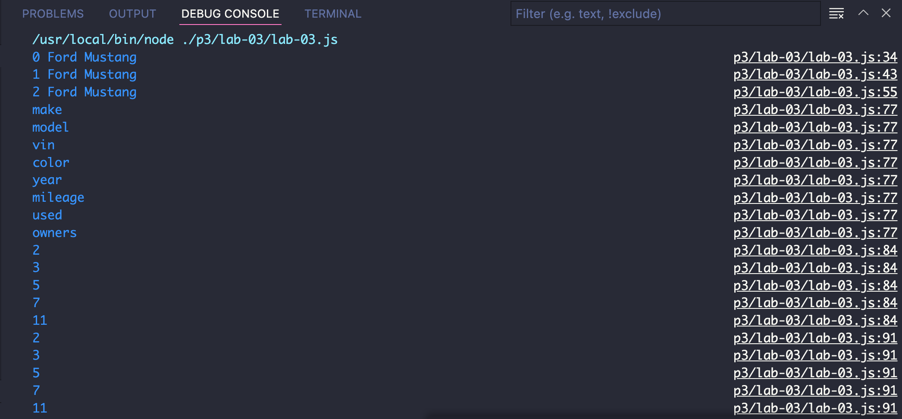

# cit281-lab-3.io
lab3 

This week's lab, we refactoring JavaScript code to use more modern syntax. We practiced destructuring an object, and converting normal functions into arrow function expressions.

We made arrays, and examine using for..in  syntax with objects, also practiced using for..of syntax with arrays

